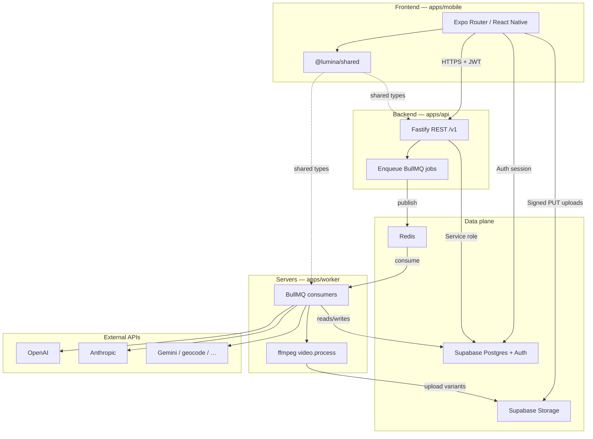

# Lumina — The Fourth Trimester Journal

> Cosmic. Emotional. Yours.

A postpartum emotional wellness app for the mother — not just the baby.

## Stack

| Layer | Technology |
|---|---|
| Mobile | Expo React Native + TypeScript |
| API | Fastify + TypeScript |
| Worker | BullMQ + TypeScript |
| Database | PostgreSQL via Supabase |
| Auth | Supabase Auth + Apple Sign In |
| Storage | Supabase Storage |
| Queue | Redis + BullMQ |
| AI Summaries | Anthropic Claude |
| Voice | OpenAI Whisper |
| Analytics | PostHog |
| Error Tracking | Sentry |

## Architecture

High-level view of how the **frontend**, **API**, **worker**, and shared infrastructure connect. Arrows show the primary runtime movers (requests, jobs, and data).



For **repo layout** (monorepo packages, not runtime), see **Repo Structure** below.

## Repo Structure

```
lumina/
├── apps/
│   ├── mobile/        # Expo React Native app (iOS + Android)
│   ├── api/           # Fastify REST API
│   └── worker/        # BullMQ background job processor
├── packages/
│   ├── shared/        # Zod schemas + TypeScript types (FE+BE contract)
│   └── ui/            # (future) Shared React Native components
├── infra/
│   └── docker/        # docker-compose + Dockerfiles
└── turbo.json
```

## Getting Started

### Prerequisites

- [Volta](https://volta.sh/) (pins Node 22 + pnpm automatically)
- [Docker Desktop](https://www.docker.com/products/docker-desktop/)
- A [Supabase](https://supabase.com/) project (cloud)

### Install dependencies

```bash
pnpm install
```

### Configure environment

Copy the example env files (commit-safe placeholders) and fill in real values:

```bash
cp apps/api/.env.example apps/api/.env
cp apps/worker/.env.example apps/worker/.env
cp apps/mobile/.env.example apps/mobile/.env
```

### Real phone + local API (smoke testing)

Expo Go on a physical device cannot reach `http://localhost:3000` on your PC. Point the app at your machine:

1. Start Redis (e.g. `docker compose -f infra/docker/docker-compose.yml up`) and run the API on `0.0.0.0` (default in [`apps/api/src/lib/env.ts`](apps/api/src/lib/env.ts)).
2. Set **`EXPO_PUBLIC_API_BASE_URL`** in `apps/mobile/.env` to your computer's LAN IP, e.g. `http://192.168.1.50:3000` (Windows: `ipconfig`; macOS: `ipconfig getifaddr en0`).
3. Set **`EXPO_PUBLIC_SUPABASE_URL`** and **`EXPO_PUBLIC_SUPABASE_ANON_KEY`** so auth and Supabase client work on device.
4. Restart Metro with cache clear after changing env: `pnpm --filter @lumina/mobile exec expo start --clear`

**Smoke checklist (manual):** sign in → create a journal entry → open Community → create a post → (optional) attach image/video with worker + Supabase Storage configured.

### Run local backend

```bash
docker compose -f infra/docker/docker-compose.yml up
```

### Run mobile app

```bash
pnpm --filter @lumina/mobile dev
```

## Scripts

| Command | Description |
|---|---|
| `pnpm dev` | Start all apps in dev mode |
| `pnpm build` | Build all apps |
| `pnpm test` | Run all test suites |
| `pnpm lint` | Lint all packages |
| `pnpm typecheck` | TypeScript check all packages |
| `pnpm format` | Format all files with Prettier |

## Privacy

Lumina treats postpartum emotional data as among the most sensitive data a user can share.
- All journal entries encrypted at rest
- Voice notes deleted from server after transcription
- No journal data sold or shared with third parties — ever
- Community posts are anonymous with themed pseudonyms
- One-tap data export and account deletion
